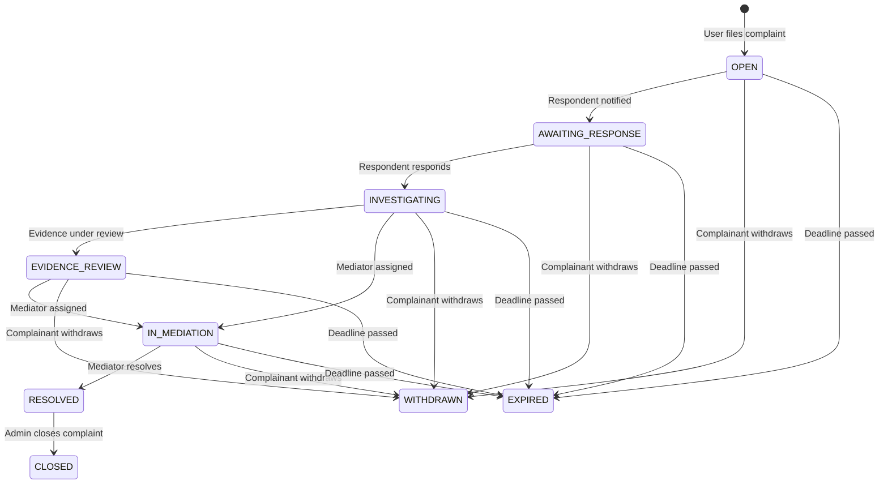

# Complaint (Khiếu nại) Feature — Use Guide / API Contract

## Complaint Lifecycle (9 States)



---

## REST API — Complaints (Disputes)

Base URL: `/api/disputes`

### 1. Create Complaint

```
POST /api/disputes
Authorization: Bearer <token>
@PreAuthorize: isAuthenticated()

{
  "complainantId": "uuid",          // must match authenticated user
  "respondentId": "uuid",
  "sessionId": "uuid|null",
  "bookingId": "uuid|null",
  "title": "string (max 200)",
  "description": "string (max 2000)",
  "complaintCategory": "SESSION_QUALITY|CONDUCT|SCHEDULING|MISREPRESENTATION|POLICY_VIOLATION|OTHER"
}
```

Response: `201 Created` — `DisputeResponse`
Errors: `400 DISPUTE_INVALID_INPUT`, `409 DISPUTE_ALREADY_EXISTS`

### 2. Get Complaint Detail

```
GET /api/disputes/{disputeId}
Authorization: Bearer <token>
@PreAuthorize: @disputeEvaluator.isParty(#disputeId, authentication.principal)
```

Response: `200 OK` — `DisputeResponse`
Errors: `403 NOT_DISPUTE_PARTY`, `404 DISPUTE_NOT_FOUND`

### 3. List My Complaints

```
GET /api/disputes/user/{userId}?page=0&size=20&status=OPEN
Authorization: Bearer <token>
@PreAuthorize: #userId == authentication.principal.id
```

Users can only list their own complaints. Optional query params: `status` filter (single value), pagination.
Response: `200 OK` — `Page<DisputeResponse>`

### 4. List All Complaints (Moderator/Admin)

```
GET /api/disputes?status=INVESTIGATING&category=SESSION_QUALITY&page=0&size=20
Authorization: Bearer <token>
@PreAuthorize: hasAnyRole('MODERATOR', 'ADMIN')
```

Optional query params: `status`, `category`, `priorityLevel`, `fromDate`, `toDate`.
Response: `200 OK` — `Page<DisputeResponse>`

### 5. Respond to Complaint

```
POST /api/disputes/{disputeId}/respond
Authorization: Bearer <token>
@PreAuthorize: @disputeEvaluator.isRespondent(#disputeId, authentication.principal)

{
  "response": "string (max 2000)"
}
```

Transitions status: `AWAITING_RESPONSE` → `INVESTIGATING`.
Errors: `403 NOT_DISPUTE_PARTY`, `400 INVALID_DISPUTE_STATUS` (wrong current state)

### 6. Withdraw Complaint

```
POST /api/disputes/{disputeId}/withdraw
Authorization: Bearer <token>
@PreAuthorize: @disputeEvaluator.isComplainant(#disputeId, authentication.principal)
```

Transitions status → `WITHDRAWN`.
Errors: `403 NOT_DISPUTE_PARTY`, `400 INVALID_DISPUTE_STATUS` (terminal state)

### 7. Assign Mediator (Moderator/Admin)

```
POST /api/disputes/{disputeId}/assign-mediator?mediatorId=uuid
Authorization: Bearer <token>
@PreAuthorize: hasAnyRole('MODERATOR', 'ADMIN')
```

Transitions status → `IN_MEDIATION`.
Creates `AdminActivityLog` entry with `actionType=DISPUTE_MEDIATOR_ASSIGNED`.

### 8. Resolve Complaint (Moderator/Admin)

```
POST /api/disputes/{disputeId}/resolve
Authorization: Bearer <token>
@PreAuthorize: hasAnyRole('MODERATOR', 'ADMIN')

{
  "outcome": "FAVOR_COMPLAINANT|FAVOR_RESPONDENT|COMPROMISE|MUTUAL_AGREEMENT|INVALID_COMPLAINT|WARNING_ISSUED|NO_OUTCOME",
  "resolutionDetails": "string (max 2000)"
}
```

Transitions status → `RESOLVED`.
Computes `resolutionTimeHours` and `slaMet`.
Creates `AdminActivityLog` entry with `actionType=DISPUTE_RESOLVED`, `previousState`/`newState`.

### 9. Upload Evidence

```
POST /api/disputes/{disputeId}/evidence
Authorization: Bearer <token>
@PreAuthorize: @disputeEvaluator.isParty(#disputeId, authentication.principal)

{
  "evidenceType": "SCREENSHOT|DOCUMENT|VIDEO|AUDIO|CHAT_LOG|EMAIL|OTHER",
  "title": "string (max 200)",
  "description": "string (max 1000)",
  "fileUrl": "string"       // S3 URL from upload endpoint
}
```

Response: `201 Created` — `DisputeEvidenceResponse`

### 10. List Evidence for Complaint

```
GET /api/disputes/{disputeId}/evidence
Authorization: Bearer <token>
@PreAuthorize: @disputeEvaluator.isParty(#disputeId, authentication.principal)
```

Response: `200 OK` — `List<DisputeEvidenceResponse>`

---

## REST API — Reports (Content Moderation)

Base URL: `/api/reports`

### 1. Create Report

```
POST /api/reports
Authorization: Bearer <token>
@PreAuthorize: isAuthenticated()

{
  "reporterId": "uuid",              // must match authenticated user
  "targetType": "USER_PROFILE|MENTOR_PROFILE|SESSION|REVIEW|MESSAGE|COMMENT|COURSE|COURSE_CONTENT|PLATFORM_ISSUE",
  "targetId": "uuid",
  "reportedUserId": "uuid|null",
  "reportCategory": "SPAM|HARASSMENT|INAPPROPRIATE_CONTENT|FRAUD|MISINFORMATION|OTHER",
  "reason": "string (max 2000)",
  "reportContext": "string (max 500)",
  "evidenceUrls": ["string"]
}
```

Response: `201 Created` — `ReportResponse`

### 2. Get Report (Moderator/Admin)

```
GET /api/reports/{reportId}
Authorization: Bearer <token>
@PreAuthorize: hasAnyRole('MODERATOR', 'ADMIN')
```

Response: `200 OK` — `ReportResponse`

### 3. List Reports (Moderator/Admin)

```
GET /api/reports?status=PENDING&page=0&size=20
Authorization: Bearer <token>
@PreAuthorize: hasAnyRole('MODERATOR', 'ADMIN')
```

Response: `200 OK` — `Page<ReportResponse>`

### 4. Assign Report (Moderator/Admin)

```
POST /api/reports/{reportId}/assign?adminId=uuid
Authorization: Bearer <token>
@PreAuthorize: hasAnyRole('MODERATOR', 'ADMIN')
```

Transitions status → `UNDER_REVIEW`. Creates `AdminActivityLog` with `actionType=REPORT_ASSIGNED`.

### 5. Resolve Report (Moderator/Admin)

```
POST /api/reports/{reportId}/resolve
Authorization: Bearer <token>
@PreAuthorize: hasAnyRole('MODERATOR', 'ADMIN')

{
  "actionTaken": "CONTENT_REMOVED|USER_WARNED|USER_SUSPENDED|USER_BANNED|NO_ACTION|CONTENT_EDITED|OTHER",
  "moderatorNotes": "string (max 2000)",
  "isUpheld": true|false
}
```

Transitions status → `RESOLVED`. Creates `AdminActivityLog` with `actionType=REPORT_RESOLVED`.

### 6. Escalate Report (Moderator/Admin)

```
POST /api/reports/{reportId}/escalate?reason=string
Authorization: Bearer <token>
@PreAuthorize: hasAnyRole('MODERATOR', 'ADMIN')
```

Transitions status → `ESCALATED`.

---

## DisputeResponse Schema

| Field | Type | Notes |
|-------|------|-------|
| id | UUID | |
| complainantId | UUID | resolved to name/avatar at gateway |
| respondentId | UUID | resolved to name/avatar at gateway |
| sessionId | UUID | nullable — link to mentoring session |
| bookingId | UUID | nullable — link to booking for financial reference |
| title | String | max 200 |
| description | String | max 2000 |
| complaintCategory | String | SESSION_QUALITY, CONDUCT, SCHEDULING, MISREPRESENTATION, POLICY_VIOLATION, OTHER |
| status | DisputeStatus | one of 9 valid states |
| priorityLevel | Integer | 1-5, default 3 |
| mediatorId | UUID | nullable — assigned platform moderator |
| mediatorAssignedAt | LocalDateTime | |
| respondentNotifiedAt | LocalDateTime | |
| respondentRespondedAt | LocalDateTime | |
| respondentResponse | String | TEXT column |
| responseDeadline | LocalDateTime | created + 3 days |
| mediationStartedAt | LocalDateTime | |
| resolvedAt | LocalDateTime | |
| outcome | DisputeOutcome | nullable until resolved |
| resolutionDetails | String | |
| resolutionTimeHours | Double | computed on resolve |
| slaMet | Boolean | computed against priority SLA |
| evidence | List\<DisputeEvidenceResponse\> | fully populated from DisputeEvidence table |
| createdAt | LocalDateTime | |
| updatedAt | LocalDateTime | |

## DisputeEvidenceResponse Schema

| Field | Type | Notes |
|-------|------|-------|
| id | UUID | |
| disputeId | UUID | |
| submittedByUserId | UUID | |
| evidenceType | String | SCREENSHOT, DOCUMENT, VIDEO, AUDIO, CHAT_LOG, EMAIL, OTHER |
| title | String | max 200 |
| description | String | max 1000 |
| fileUrl | String | S3/CDN URL |
| filename | String | original upload name |
| mimeType | String | |
| fileSize | Long | bytes |
| isReviewed | Boolean | default false |
| reviewedAt | LocalDateTime | nullable |
| reviewedByUserId | UUID | nullable |
| reviewNotes | String | nullable |
| isFlagged | Boolean | default false |
| flagReason | String | nullable |
| createdAt | LocalDateTime | |

## ReportResponse Schema

| Field | Type | Notes |
|-------|------|-------|
| id | UUID | |
| reporterId | UUID | |
| targetType | ReportTargetType | |
| targetId | UUID | |
| reportedUserId | UUID | nullable |
| reportCategory | String | SPAM, HARASSMENT, INAPPROPRIATE_CONTENT, FRAUD, MISINFORMATION, OTHER |
| reason | String | TEXT column |
| status | ReportStatus | |
| priorityLevel | Integer | |
| assignedToAdminId | UUID | nullable |
| resolvedAt | LocalDateTime | nullable |
| actionTaken | String | nullable |
| moderatorNotes | String | nullable |
| isUpheld | Boolean | nullable |
| escalationLevel | Integer | |
| evidenceUrls | List\<String\> | URLs only (content moderation, distinct from DisputeEvidence) |
| createdAt | LocalDateTime | |

---

## Priority → SLA Mapping

| Priority | Label | SLA Deadline |
|----------|-------|-------------|
| 1 | Critical | 24 hours |
| 2 | High | 3 days |
| 3 | Medium | 7 days (default) |
| 4 | Low | 14 days |

---

## Authorization Summary

| Role | Permissions |
|------|------------|
| **Authenticated User** | Create complaints, respond to complaints against them, view their own complaints, upload evidence to their complaints, withdraw own complaints, create reports |
| **MODERATOR** | View all complaints, assign mediators, resolve complaints, view all reports, assign/report/escalate reports, review evidence, flag evidence |
| **ADMIN** | All MODERATOR permissions + close resolved complaints |

**Principle:** Every endpoint is guarded by `@PreAuthorize`. Service-layer methods additionally validate authorization before mutating state. No endpoint is open to unauthenticated access, and no authenticated user can act on another user's dispute.
